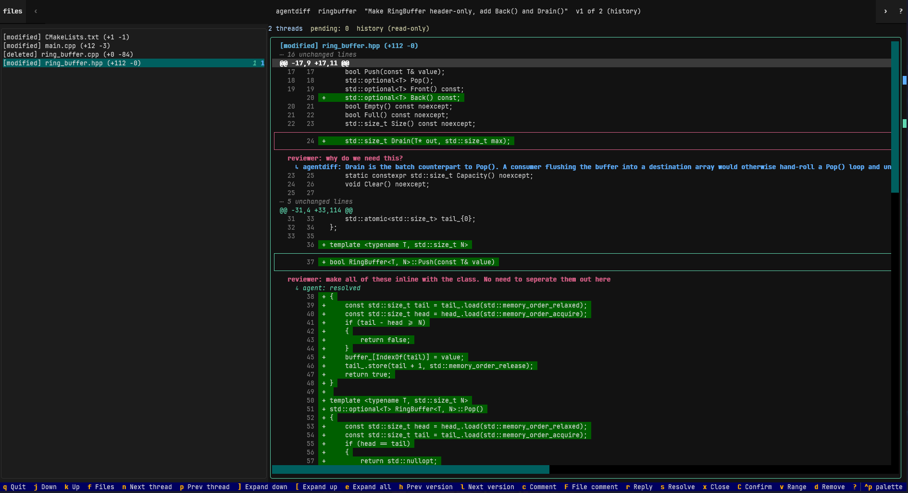

# agentdiff

agentdiff gives your AI coding agent the tools to receive, understand, and act
on your code review feedback. You comment inline on a diff in a terminal UI — on
an exact line or range, added or removed — and each comment becomes a thread the
agent can reply to, explain, or resolve. Comments persist in a local store across
amends and export as a versioned JSON contract any harness can consume, and only
you can close a thread.



```
  ┌───────────────┐
  │     Human     │
  └───────┬───────┘
          │
  ┌───────▼───────┐
  │      TUI      │
  └───────┬───────┘
          │
  ┌───────▼───────┐
  │  core engine  │
  │  git ingest + │
  │  local store  │
  └───────┬───────┘
          │
  ┌───────▼───────┐
  │  CLI / JSON   │
  │      / MCP    │
  └───────┬───────┘
          │
  ┌───────▼───────┐
  │ agent harness │
  └───────────────┘
```

## Install

Requires Python ≥ 3.10 and `git`.

```sh
pip install agentdiff      # or: pipx install agentdiff
```

## Quickstart

agentdiff reviews **committed** changes — by default the latest commit against
its parent (`HEAD~1..HEAD`). Commit your work first.

```sh
# 1. Open the review UI on the current commit and leave comments.
agentdiff
```

In the TUI: `j`/`k` move · `c` comment · `r` reply · `s` resolve · `C` **confirm
staged comments** · `q` quit · `?` help. Comments are staged in memory — nothing
is written (and no agent sees anything) until you press `C`.

```sh
# 2. Hand the comments to your agent as JSON.
agentdiff export --branch "$(git branch --show-current)" --format json
```

## Usage

Comments live in `.agentdiff/` at the repo root — one file per change. It's a
local store, so add it to your `.gitignore`: comments never ship with your code.

A **change** is one review of a branch's committed work; it keeps an append-only
list of **versions** (each amend adds one), and every **comment** is anchored to
a line on the version it was written on.

## Docs

- [Agent guide](src/agentdiff/docs/agent-guide.md) — how a harness drives the
  CLI, thread semantics, the `role` / `last_author` signal, and the JSON
  contract.
- [TUI guide](src/agentdiff/docs/tui-guide.md) — every key, the selection model,
  staging vs confirm, the colors, navigation, and the editor. Also in-app via
  `?`.
- [ARCHITECTURE.md](ARCHITECTURE.md) — the source of truth: structure, data
  model, contracts, decisions, and roadmap.

## Development

```sh
python3 -m venv .venv
.venv/bin/pip install -e '.[dev]'

.venv/bin/pytest
.venv/bin/ruff check .
.venv/bin/ruff format --check .
```

- `AGENTS.md` — how agents work in this repo.
- `ARCHITECTURE.md` — structure, contracts, and decisions.

## Building the docs

The guides are Markdown under `src/agentdiff/docs/`, which is also the MkDocs
`docs_dir`. The doc tooling (MkDocs + mkdocstrings) is a **dev** dependency, not
a runtime one:

```sh
pip install -e '.[dev]'
mkdocs serve            # live preview at http://127.0.0.1:8000
mkdocs build --strict   # build the site into site/
```

`--strict` turns warnings into errors, so a broken link or a page missing from
`nav` fails the build.

Code docs are **scaffolded, not generated yet** — `mkdocs.yml` already configures
the `mkdocstrings` plugin with `paths: [src]`. Once the planned refactor lands,
add a page that pulls in the public modules with a directive:

````markdown
# API reference

::: agentdiff.model
::: agentdiff.diff
::: agentdiff.anchor
::: agentdiff.store
::: agentdiff.export
````

Each `:::` directive renders that module's docstrings, signatures, and members.

## Status

Working: the TUI (diff viewer, inline commenting, version history) and the CLI
(discovery, export, authoring, resolve/reopen/close). Roadmap: side-by-side view,
MCP server, optional GUI.
